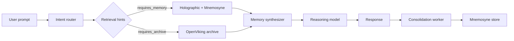

# Helios Memory

Provider-agnostic cognitive memory plugin for AI agent systems. Helios Memory augments agent reasoning with a three-tier memory architecture and a configurable pipeline: **prompt → router → retrieve → synthesize → reason → consolidate**.

Designed for integration with Hermes-like agent frameworks via a simple async `process(user_prompt, session_id)` entrypoint.

## Three memory tiers

| Tier | Name | Role | Local provider | Cloud provider |
|------|------|------|----------------|----------------|
| L0 | **Holographic** | Short-term cache with TTL and tag search | `SQLiteCacheStore` | `UpstashRedisCacheStore` (MVP stub) |
| L1 | **Mnemosyne** | Episodic memory (facts, events, conflicts) | `SQLiteEpisodicStore` | `SupabaseEpisodicStore` (MVP stub) |
| L2 | **OpenViking** | Semantic archive with tiered retrieval (L0/L1/L2) | `SQLiteVectorArchive` | `SupabaseVectorArchive` (MVP stub) |

All three local tiers share a single SQLite database file (`storage.sqlite_path`).

## Deployment modes

| Mode | Stores | Reasoning |
|------|--------|-----------|
| `local` | SQLite for all tiers | FastFlowLM (+ optional Ollama fallback) |
| `cloud` | Upstash + Supabase | OpenAI-compatible cloud API with privacy enforcement |
| `hybrid` | Local SQLite cache + cloud episodic/vector | FastFlowLM (+ optional Ollama fallback) |

## Architecture



Routing rules live in [`config/routing_rules.yaml`](config/routing_rules.yaml). Categories include `memory_lookup_needed`, `project_context_needed`, `sensitive_request`, `task_request`, and `small_talk`.

## Requirements

- Python 3.11+
- Optional: [FastFlowLM](http://127.0.0.1:52625/v1) for local NPU inference (default base URL)
- Optional: [Ollama](http://127.0.0.1:11434/v1) as a local fallback when FastFlowLM is unavailable

## Installation

```bash
python -m venv .venv

# Windows
.venv\Scripts\activate

# macOS / Linux
source .venv/bin/activate

pip install -e ".[dev]"
```

## FastFlowLM setup (local mode)

FastFlowLM exposes an OpenAI-compatible API. Start the service, then confirm the endpoint responds:

- Default base URL: `http://127.0.0.1:52625/v1`
- Override via config (`providers.fastflowlm_url`) or `HELIOS_FASTFLOWLM_BASE_URL`
- Default reasoning model: `gemma4-it:e4b` (configurable via `models.reasoning_model`)

If FastFlowLM is down, the plugin can fall back to Ollama when `use_ollama_fallback=True` (default in `create_reasoning_model`).

## Quick start (local mode)

```python
import asyncio

from helios_memory.config import HeliosConfig
from helios_memory.plugin import HeliosMemoryPlugin
from helios_memory.privacy import PrivacyEnforcer
from helios_memory.providers.factory import (
    create_consolidation_worker,
    create_intent_router,
    create_local_stores,
    create_memory_synthesizer,
    create_reasoning_model,
)


async def build_plugin(config: HeliosConfig) -> HeliosMemoryPlugin:
    cache, episodic, vector = await create_local_stores(config)
    return HeliosMemoryPlugin(
        config=config,
        cache_store=cache,
        episodic_store=episodic,
        vector_archive=vector,
        intent_router=create_intent_router(config),
        synthesizer=create_memory_synthesizer(config),
        reasoning_model=create_reasoning_model(config),
        consolidation_worker=create_consolidation_worker(episodic),
        privacy=PrivacyEnforcer(config.privacy),
    )


async def main() -> None:
    config = HeliosConfig.load("config/local.yaml")
    plugin = await build_plugin(config)
    response = await plugin.process(
        "What did we decide about the API design?",
        session_id="demo",
    )
    print(response)


if __name__ == "__main__":
    asyncio.run(main())
```

Copy `config/local.yaml.example` to `config/local.yaml` before running.

See also:

- [`examples/agent_integration.py`](examples/agent_integration.py) — minimal plugin bootstrap
- [`examples/custom_agent_hook.py`](examples/custom_agent_hook.py) — wrapping a simple agent loop

## Configuration

Load configuration from YAML with environment variable overrides:

```python
from helios_memory.config import HeliosConfig

config = HeliosConfig.load("config/local.yaml")   # YAML + env overrides
config = HeliosConfig.from_yaml("config/cloud.yaml")
config = HeliosConfig()                           # defaults + env only
```

Example files (copy and edit):

| File | Mode |
|------|------|
| [`config/local.yaml.example`](config/local.yaml.example) | Local SQLite + FastFlowLM |
| [`config/cloud.yaml.example`](config/cloud.yaml.example) | Cloud stores + cloud reasoning |
| [`config/hybrid.yaml.example`](config/hybrid.yaml.example) | Local cache + cloud episodic/archive |

`HeliosConfig` keys:

| Key | Type | Default | Description |
|-----|------|---------|-------------|
| `mode` | `local` \| `cloud` \| `hybrid` | `local` | Deployment mode |
| `providers.fastflowlm_url` | string | `http://127.0.0.1:52625/v1` | FastFlowLM OpenAI-compatible base URL |
| `providers.ollama_url` | string | `http://127.0.0.1:11434/v1` | Ollama fallback base URL |
| `models.routing_model` | string | `gemma4-it:e2b` | Intent routing model (planned LLM fallback) |
| `models.synthesis_model` | string | `gemma4-it:e4b` | Memory brief synthesis model (planned) |
| `models.reasoning_model` | string | `gemma4-it:e4b` | Primary reasoning model |
| `models.ollama_model` | string | `gemma4:12b` | Ollama fallback model |
| `storage.sqlite_path` | string | `helios_memory.db` | SQLite path for local/hybrid cache (and all tiers in local mode) |
| `memory_brief_max_tokens` | int | `2000` | Token budget for synthesized memory brief |
| `consolidation_enabled` | bool | `true` | Run async post-response consolidation |
| `privacy.*` | object | see below | Cloud privacy policy |

### Environment variables

Helios config uses the `HELIOS_` prefix. Nested keys use double underscores.

| Variable | Required | Description |
|----------|----------|-------------|
| `HELIOS_MODE` | No | `local`, `cloud`, or `hybrid` |
| `HELIOS_PROVIDERS__FASTFLOWLM_URL` | No | FastFlowLM base URL |
| `HELIOS_PROVIDERS__OLLAMA_URL` | No | Ollama base URL |
| `HELIOS_MODELS__ROUTING_MODEL` | No | Routing model name |
| `HELIOS_MODELS__SYNTHESIS_MODEL` | No | Synthesis model name |
| `HELIOS_MODELS__REASONING_MODEL` | No | Reasoning model name |
| `HELIOS_MODELS__OLLAMA_MODEL` | No | Ollama fallback model name |
| `HELIOS_STORAGE__SQLITE_PATH` | No | SQLite database path |
| `HELIOS_MEMORY_BRIEF_MAX_TOKENS` | No | Memory brief token budget |
| `HELIOS_CONSOLIDATION_ENABLED` | No | `true` / `false` |
| `HELIOS_PRIVACY__ALLOW_CLOUD_INFERENCE` | No | Allow cloud LLM calls |
| `HELIOS_PRIVACY__ALLOW_RAW_FILE_UPLOAD` | No | Opt-in for raw file uploads to cloud (default `false`) |
| `HELIOS_PRIVACY__REDACT_SENSITIVE` | No | Redact sensitive patterns before cloud calls |
| `HELIOS_PRIVACY__BLOCK_SENSITIVE_BY_DEFAULT` | No | Block sensitive content from cloud |
| `HELIOS_FASTFLOWLM_BASE_URL` | No | Runtime override for FastFlowLM URL (provider-level) |
| `HELIOS_OLLAMA_BASE_URL` | No | Runtime override for Ollama URL (provider-level) |
| `HELIOS_CLOUD_API_KEY` | Cloud | API key for cloud reasoning |
| `HELIOS_CLOUD_BASE_URL` | No | OpenAI-compatible cloud base URL (default `https://api.openai.com/v1`) |
| `HELIOS_CLOUD_MODEL` | No | Cloud model override (default `gpt-4o-mini`) |
| `SUPABASE_URL` | Cloud | Supabase project URL |
| `SUPABASE_KEY` | Cloud | Supabase anon/service key |
| `SUPABASE_DB_URL` | Cloud | Supabase Postgres connection string |
| `UPSTASH_REDIS_REST_URL` | Cloud | Upstash Redis REST endpoint |
| `UPSTASH_REDIS_REST_TOKEN` | Cloud | Upstash Redis REST token |
| `DATABASE_URL` | No | Direct Postgres URL (`PostgresEpisodicStore`, alternate adapter) |

Never commit real keys. Use placeholders like `your-supabase-key` in config files; set secrets in the environment only.

## Agent integration

`HeliosMemoryPlugin` accepts injected stores and routing components. Use the factory helpers in `helios_memory.providers.factory`:

| Factory | Purpose |
|---------|---------|
| `create_local_stores(config)` | SQLite cache, episodic, vector |
| `create_cloud_stores(config)` | Upstash + Supabase tiers |
| `create_hybrid_stores(config)` | Local cache + cloud episodic/vector |
| `create_reasoning_model(config)` | FastFlowLM, Ollama fallback, or cloud provider |
| `create_intent_router(config)` | Rule-based router from `routing_rules.yaml` |
| `create_memory_synthesizer(config)` | Template memory brief builder |
| `create_consolidation_worker(episodic_store)` | Post-response memory extraction |

```python
response = await plugin.process(user_prompt, session_id="session-123")
```

The plugin does not include a `from_config()` helper yet — wire factories manually (see examples above).

## Running tests

```bash
pytest -v
```

Type checking (optional):

```bash
pyrefly check --summarize-errors
```

## Privacy and security

Helios Memory enforces a configurable privacy policy (`PrivacyPolicy` / `privacy` config block) before cloud-bound calls:

- **Secrets in environment only** — API keys and database URLs are read from env vars, never hardcoded.
- **No raw file uploads by default** — `allow_raw_file_upload` defaults to `false`; cloud file uploads require explicit opt-in.
- **Content classification** — Heuristic detection of `public`, `internal`, `sensitive`, and `secret` content.
- **Sensitive content blocked** — Secrets never go to cloud providers; sensitive content is blocked unless policy allows it.
- **Redaction** — When enabled, known patterns (API keys, emails, SSN-like sequences) are redacted before cloud transmission.
- **Sensitive requests** — The `sensitive_request` routing category triggers stricter handling in cloud mode.

Local mode keeps all memory tiers on disk (SQLite) and routes reasoning to FastFlowLM/Ollama on localhost by default.

## Local development with subagents

This project was built with a Cursor subagent swarm. See [`.cursor/agents/README.md`](.cursor/agents/README.md) for worker roles and execution order.

## License

See repository license (if present).
